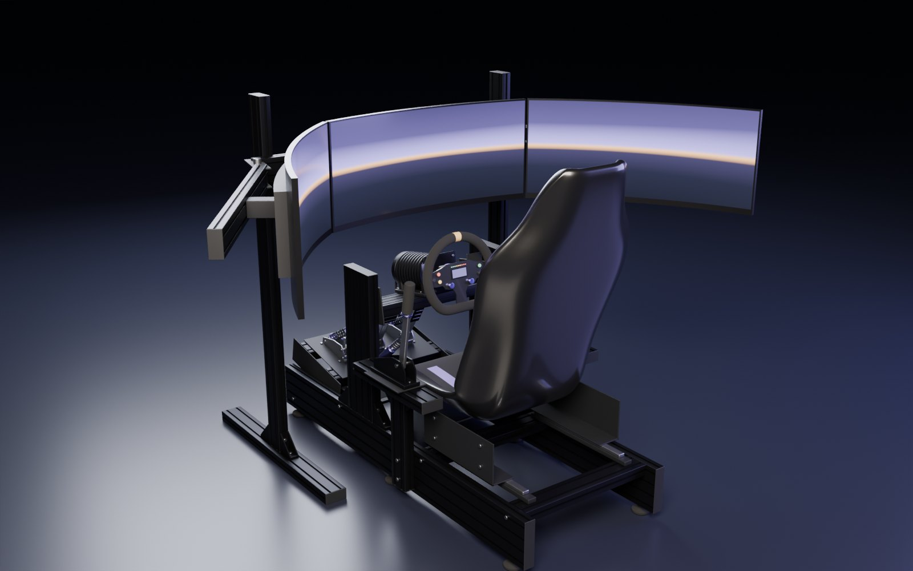
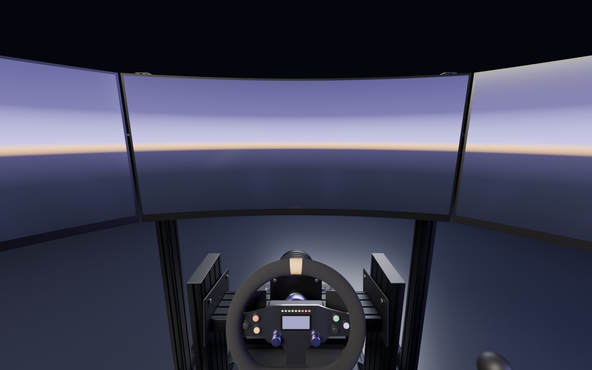
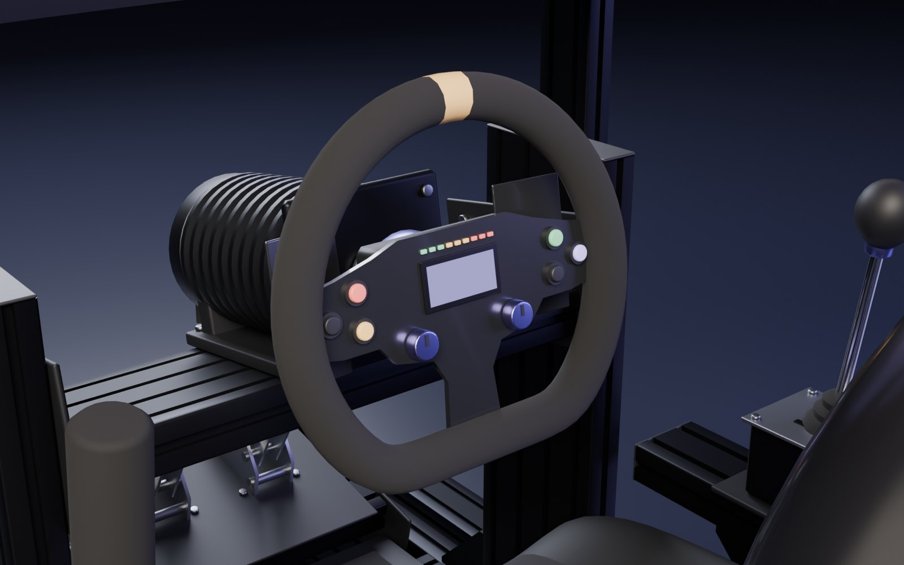

# Rig builder in 3D

A to-scale 3D model of a sim rig, and a copy of the rig-builder mockup that uses it in place of the flat
schematic. Nothing here reads telemetry.

The model is also live in the app: the **Rig** item in the left rail (`?screen=hardware`) opens it in
`web/components/proctor/screens/HardwareScreen.tsx`. That screen is a rig builder working from a **demo
catalogue**: the driver picks a layout, a screen count and a product for each of the seven slots, and it is
kept in their browser only (see "The builder in the app" below). The install dates, the per-component
history and the health tab in the mockup are still design material.

The app draws the rig in three layouts, with one screen or three (see "Layouts" below). The mockup page
only ever shows the cockpit.



| | |
|---|---|
|  |  |

## What it is, and what it is not

- **A mockup.** Every number on the page is a sample literal under a "sample data" tag. None of it may be
  carried into a real screen (see "No screen may carry a measurement as a literal" in the root `CLAUDE.md`).
- **Generic parts.** Each part stands in for its category. No maker's shapes, logos or lettering: the
  mockup's own rule is exact models, generic art.
- **To scale for one sample rig**: three 34-inch 21:9 1500R screens, 620 mm from the eye point.
- **One known inconsistency, left as found:** the mockup's sample field of view (104.6°) does not match
  that sample rig. Three 34-inch screens at 620 mm wrap roughly 196°. Fix it before it seeds anything real.
- The Blender script is asset tooling that lives with the docs. It is not app code and does not touch the
  Python-in-`/parser`, TypeScript-in-`/web` boundary.

## What is here

| Path | What it is |
|---|---|
| `blender/build_rig.py` | Builds a rig in Blender from numbers (no hand modelling), exports the GLB, renders stills. One run builds one layout. |
| `out/proctor_rig.glb` | The cockpit: Y up, metres, about 49k triangles, 1.2 MB. One node per slot (`slot_frame`, `slot_monitors`, `slot_wheelbase`, `slot_rim`, `slot_pedals`, `slot_shifter`, `slot_handbrake`) plus `anchor_eye` at the driver's eye point. |
| `out/proctor_rig_stand.glb`, `out/proctor_rig_desk.glb` | The wheel stand (about 30k triangles) and the desk (about 27k), with the same nodes. |
| `out/still_*.jpg` | Cycles renders of the cockpit. |
| `out/poster.jpg`, `poster_stand.jpg`, `poster_desk.jpg` | What is shown while the 3D loads: the `hero` view of each layout as a 1280x800 JPEG. |
| `out/floor_ao.png`, `floor_ao_stand.png`, `floor_ao_desk.png` | Top-down soft shadow of each layout, laid on the floor as a contact shadow. |
| `sync.mjs` | Copies the models, shadows and posters into `web/public/rig/` under the names the app asks for. |
| `page/source_mockup.html` | The original rig-builder mockup, kept verbatim. |
| `page/viewer.js`, `viewer.css`, `stage.html` | The 3D view (three.js r147) with its markup and styles. Nocturne tokens only. |
| `page/build.mjs` | Patches the original mockup and inlines the model, shadow map and poster into one file. |

The built page is not committed. One command makes it:

```bash
node docs/rig-3d/page/build.mjs     # writes docs/rig-3d/dist/
node docs/rig-3d/page/serve.mjs     # http://localhost:4317/preview.html
```

## Layouts

Not everyone drives from a cockpit, so the script builds three rigs. They are drawings of how a rig is
commonly put together. None of them is a record of anyone's rig.

| `--layout` | What carries it | Usual screens |
|---|---|---|
| `cockpit` (default) | An aluminium profile frame with a bucket seat, and a freestanding screen stand. | Three 34-inch 1500R |
| `stand` | A folding wheel stand that carries the wheel, pedals and shifter; an office chair; the same screen stand. | One 34-inch 1500R |
| `desk` | A desk with the wheel, shifter and handbrake clamped to its edge, pedals on a mat on the floor, an office chair, each screen on its own foot. | One 27-inch flat |

Every layout has the same seven slot nodes, in different places, so whatever reads a GLB does not care which
one it got. Each model always carries three screens. The two side screens are a child node of
`slot_monitors` called `monitors_side`, and the wings of the stand that hold them are `frame_side` under
`slot_frame`. Hiding the nodes whose names end `_side` leaves one screen, which is how the app's
"One screen / Triples" switch works without a second model. `--screens single|triple` only changes what a
render shows.

The floor shadow and the poster of each layout are made with its usual screens, so they are a close match
rather than an exact one when the other screen count is picked in the app.

## Rebuilding the model

Needs Blender 5.x on the PATH (or call its executable directly).

```bash
cd docs/rig-3d

# model + GLB + floor shadow map, about 20 s. Once per layout: cockpit is the default.
blender -b --python blender/build_rig.py -- --floor-ao --samples 64
blender -b --python blender/build_rig.py -- --layout stand --floor-ao --samples 64
blender -b --python blender/build_rig.py -- --layout desk --floor-ao --samples 64

# stills, about 2 min each at 1600x1000 / 128 samples on a 6-core CPU; --engine workbench for a quick shape check
blender -b --python blender/build_rig.py -- --no-export --engine cycles --samples 128 --views hero,pov,wheel
blender -b --python blender/build_rig.py -- --layout desk --no-export --engine cycles --samples 128 --views hero
```

The cockpit keeps the plain file names it always had (`proctor_rig.glb`, `floor_ao.png`); the other two get
a suffix (`proctor_rig_desk.glb`, `preview_desk_hero.png`). A poster is the `hero` render of a layout
scaled to 1280x800 and saved as a JPEG named `poster.jpg`, `poster_stand.jpg` or `poster_desk.jpg`.

Everything hangs off the `LAYOUTS` table at the top of `build_rig.py`: per layout, the eye point, the rim
centre and column tilt, where the pedals, shifter and handbrake sit, and the screens' distance, radius,
size and side angle. Change a number, rebuild, look at the stills.

## How the page talks to the 3D view

The page script stays the source of truth. It calls `rig3d.sync(selected, rig)` when anything changes,
`rig3d.focus(slot)` to fly the camera and `rig3d.pop(slot)` after a swap. The view calls `__rig.choose(slot)`
when a part, a caption or the "+" on an empty slot is clicked. An empty slot is drawn as a dashed ghost on its
mount. The screens are not a texture: each pixel is shaded along the ray from the eye point, so the horizon
and the road stay continuous across the three panels. If WebGL or three.js is unavailable, the page shows the
rendered still and says so.

## The copy the app serves

`web/public/rig/` holds three files per layout, named by the layout's key in `web/lib/proctor/rig.ts`:
`<key>.glb`, `<key>-floor.png` and `<key>.jpg`, for `cockpit`, `stand` and `desk`. They are copies of the
ones in `out/`. After rebuilding, copy them across:

```bash
node docs/rig-3d/sync.mjs
```

`web/lib/proctor/rig.test.ts` opens every served GLB and checks its node names against the slot list, that
the side screens are a `_side` child of the monitors slot, and that the shadow and poster it names exist.
A rebuild that renames a slot fails a test rather than shipping a part that cannot be clicked.

## The builder in the app

The Rig screen is where a driver says what they drive on: the layout, one screen or three, and a product
for each slot. A first plain visit to the app is walked there by the guided setup, which asks for the level
of detail first (`web/components/proctor/shell/SetupScreen.tsx`, `web/lib/setup.ts`). `?setup=1` runs the
setup again, and so does the button under the rig on the Rig screen. The phone app at `/m` has no setup.

- **It is the driver's word, not a reading.** Proctor cannot detect hardware. Nothing in a `.ibt` names the
  product behind a channel, so picking one changes no number anywhere.
- **The catalogue is a demo.** `web/lib/proctor/rigCatalog.ts` is a short hand-picked list, seeded from the
  mockup and widened with desk-clamp gear. The makes and models are real; the one-line descriptions have not
  been checked against the makers' sheets. Every row on screen carries a "demo catalogue" tag.
- **It is kept in the browser only**, under the storage key `proctor-rig-layout`. There is no table for a
  rig, so it does not follow the driver to another device and nothing downstream reads it.
- **A slot has three states**: not said, said to be empty, or a product. Only the shifter and the handbrake
  can be marked empty, and an empty slot is left out of the drawing. Otherwise the drawing stays generic
  whichever product is picked. The loading poster always shows the layout with every part and its usual
  screens, so it can differ from the rig for a moment before the 3D view arrives.

The mockup page here and the app screen draw the same scene with different three.js builds. The mockup uses
the classic-script r147 build because the sandbox it was published in only loads plain script tags; the app
uses the `three` package. Newer three.js only honours a material's own reflection strength for an
environment map the material owns, which is why `RigScene.tsx` hands the room map to every material.

## What the full builder still needs

- Somewhere to save what is mounted: a table, a migration and a route. Today it lives in one browser.
- A real catalogue in place of the demo list in `rigCatalog.ts`, with its descriptions verified. Keep the
  ids stable, or map the old ones forward, so a rig someone has already built still reads back.
- The per-component history from the mockup (install dates, what a part replaced), reading that table and
  nothing else.
